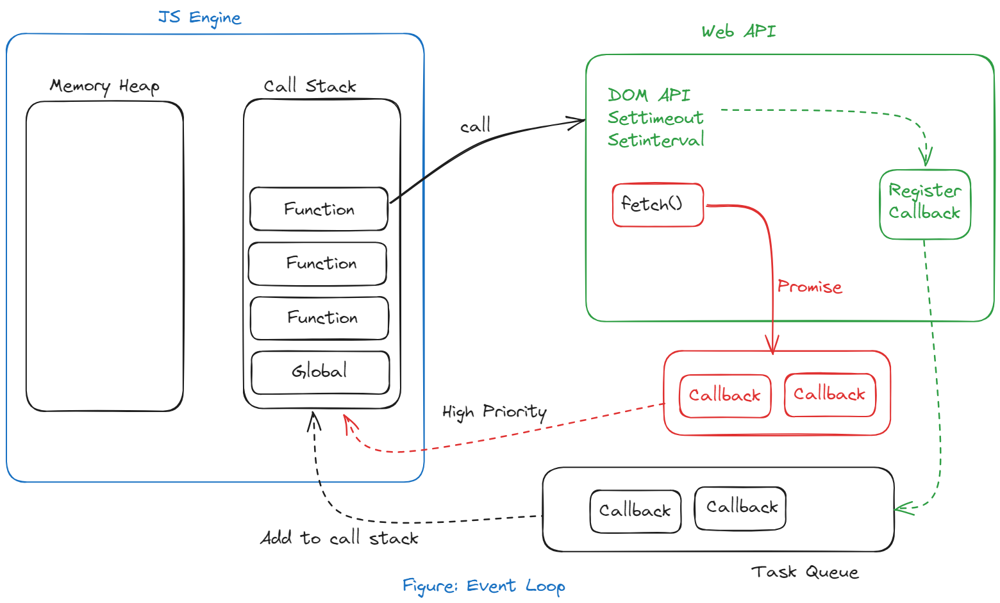

# Async Javascript fundamentals

- JavaScript is a synchronous and single-threaded (in one thread everything executes) language by default, meaning one task or line of code has to be executed before the next one can start.
- This can slow down the performance of a web page because the browser has to wait for the JavaScript to finish executing before it can render the next part of the page.

---

**Execution Context:** 

The execution context in JavaScript is the environment in which the JavaScript code is executed. It is a fundamental concept that defines how the code is executed and what variables and functions are available to it. It executes one line of code at a time.

In a single thread, each operation waits for the last one to complete before executing.

**Types of Execution Context:**

1. **Global Execution Context**: This is the default execution context that is created when the JavaScript code first starts running. It represents the global scope.
2. **Function Execution Context**: A new execution context is created whenever a function is called. This represents the local scope of the function.
3. **Eval Function Execution Context**: Any code executed within the `eval()` function also creates its own execution context.

**Phases of Execution Context:**

1. **Creation Phase**: In this phase, the JavaScript engine sets up the execution context. It:
    - Creates a global object (e.g. the `window` object in a browser)
    - Sets up memory space for variables and functions (known as hoisting)
    - Determines the value of the `this` keyword
2. **Execution Phase**: In this phase, the code is executed line by line. Variables are assigned their values, functions are invoked, and the code is interpreted.

---

| Blocking Code | Non - Blocking Code |
| --- | --- |
| 1. Blocks the flow of program | 1. Does not block execution |
| 2. Reads file Synchronously | 2. Reads file Asynchronously |

